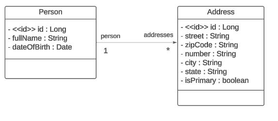

## API de Gerenciamento de Pessoas e Endereços

Esta API foi desenvolvida para facilitar o gerenciamento de informações pessoais e endereços, permitindo a criação, edição e consulta de dados de pessoas e seus respectivos endereços. A API também permite definir um endereço como principal para cada pessoa.

## Diagrama de classes

## Funcionalidades

- **Gerenciamento de Pessoas**: Permite criar, editar e consultar informações de uma ou mais pessoas.
- **Gerenciamento de Endereços**: Permite criar, editar e consultar endereços de uma pessoa, assim como definir um endereço como principal.

## Endpoints

Endpoints estão disponivel no arquivo [postman_collection]

## Tecnologias Utilizadas

- Linguagem de programação: Java 21
- Framework: SpringBoot
- Banco de dados: H2
